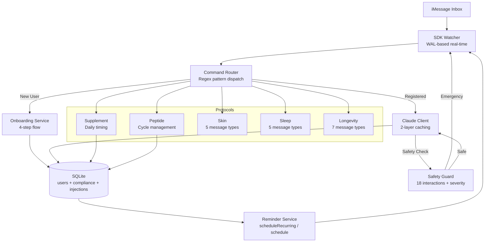

```markdown
<div align="center">
  
```
██╗  ██╗███████╗ █████╗ ██╗████████╗██╗  ██╗███████╗██████╗  █████╗ ███╗   ██╗
██║  ██║██╔════╝██╔══██╗██║╚══██╔══╝██║  ██║██╔════╝██╔══██╗██╔══██╗████╗  ██║
███████║█████╗  ███████║██║   ██║   ███████║█████╗  ██████╔╝███████║██╔██╗ ██║
██╔══██║██╔══╝  ██╔══██║██║   ██║   ██╔══██║██╔══╝  ██╔══██╗██╔══██║██║╚██╗██║
██║  ██║███████╗██║  ██║██║   ██║   ██║  ██║███████╗██║  ██║██║  ██║██║ ╚████║
╚═╝  ╚═╝╚══════╝╚═╝  ╚═╝╚═╝   ╚═╝   ╚═╝  ╚═╝╚══════╝╚═╝  ╚═╝╚═╝  ╚═╝╚═╝  ╚═══╝
                                                                                
██╗ ██████╗ ███████╗
██║██╔═══██╗██╔════╝
██║██║   ██║███████╗
██║██║   ██║╚════██║
██║╚██████╔╝███████║
╚═╝ ╚═════╝ ╚══════╝

**iMessage-native precision wellness assistant — multi-user, AI-powered, protocol-driven**

</div>

<br/>

<div align="center">
  


</div>

<br/>

<div align="center">
  
| | | |
|:---:|:---:|:---:|
| 🧬 **17**<br/>*Supplements* | 💉 **10**<br/>*Peptides* | 🛡️ **18**<br/>*Interactions* |
| 📊 **99%**<br/>*Cache Hit Rate* | ⚡ **<2s**<br/>*Response Time* | 👥 **∞**<br/>*Unlimited Users* |

</div>

<br/>

---

## ✨ What is Healthspan OS?

> **Healthspan OS runs as a background service on macOS.** It reads your iMessage inbox in real time, routes messages from registered users through a command system, and responds with personalized health guidance generated by Claude (Anthropic). 

**No app to download. No account to create. It works through iMessage.**

🔹 *Also proactively messages users — daily supplement reminders, peptide injection prompts, protocol check-ins — all timed to each user's individual schedule.*

<br/>

---

## 🎯 Features

### 🧬 Protocol Engine

| Protocol | Capabilities |
|----------|--------------|
| **Supplement** | Daily reminders at wake/sleep times, dose detection, streak tracking |
| **Peptide** | Full injection cycle management — pre-reminder, injection prompt, post-check-in, cycle-end — with BAC water reconstitution guides |
| **Skin** | Morning stack, midday SPF, evening routine, weekly photo check-in (Sundays), biweekly collagen review |
| **Sleep** | Morning light anchor, 2pm caffeine cutoff, pre-sleep stack (1h before), wind-down protocol (30min before), sleep quality check-ins |
| **Longevity** | NAD+ stack timing, CoQ10 with meals, Berberine before carbs, fasting tracking, monthly bloodwork (1st), Rapamycin weekly (Saturdays), quarterly senolytics |

🔹 *Protocols auto-activate from each user's `goals` array.*

<br/>

### 🤖 AI Integration (Claude + Prompt Caching)

**Two-layer prompt caching architecture:**

1. **Layer 1** — Base system prompt (`cache_control: ephemeral`)
   - Health assistant persona, safety rules, response style

2. **Layer 2** — Domain-specific templates per command
   - Progress analysis, side effects, reconstitution, skin coaching, sleep coaching, onboarding

🔹 *Only user message + context are uncached per request — minimal latency & API costs*

**AI-powered flows:**
- General health Q&A
- Progress report analysis (30-day compliance + protocol adherence)
- Side effect correlation (severity-gated — emergencies bypass AI)
- Peptide reconstitution Q&A
- Skin protocol coaching (weekly ratings, goal-specific tips)
- Sleep coaching (HRV interpretation, circadian science)
- Personalized welcome messages on onboarding

<br/>

### 📊 Compliance Tracking

| Feature | Implementation |
|---------|---------------|
| **Dose logging** | Every taken/skipped dose → `compliance_log` |
| **Injection tracking** | Every peptide injection → `peptide_injections` |
| **Streak calculation** | `calculateStreak()` — current/best per supplement |
| **Report generation** | `generateReport()` — 30-day trends + trajectory analysis |
| **User queries** | `status` (full report) or `streak` (supplement breakdown) |

<br/>

### 🛡️ Safety Layer

**Interaction checker** — Runs on every `registerUser()` call
- Checks user's full stack (supplements + peptides) against **18 known interactions**
- Known interactions include: Magnesium ↔ Zinc competition, Fish Oil + high-dose Vitamin E bleeding risk, Berberine + Metformin hypoglycemia potentiation, NAD+ precursors + SIRT1 activators dose timing, and 14 others
- ⚠️ Warnings sent before first reminder

**Side effect handler** — Severity classification (regex-based, pre-LLM)
- 🔴 `emergency` (chest pain, difficulty breathing, anaphylaxis) → immediate 911, no AI delay
- 🟠 `severe` (severe allergic reaction, extreme dizziness) → urgent escalation
- 🟡 `moderate` → AI analysis with dose correlation
- 🟢 `mild` → standard AI analysis

<br/>

### 👥 Multi-User Platform

Every feature is scoped per user:
- Each user → their own row in `users` table
- Reminders scheduled per user with timezone + wake/sleep times
- Protocol activation per-user based on goals
- Compliance logs keyed by `userId`
- Conversation flow state keyed by phone number

<br/>

### 🔌 Multi-Step Onboarding

Unknown senders who message `start`, `hi`, `hello`, or `join` are offered onboarding. 

**4-step conversation flow:**
1. Name
2. Goals (longevity / sleep / skin / energy / cognition / body-composition)
3. Wake time
4. Sleep time

🔹 *State held in `ConversationFlowManager` (in-memory, 30-minute TTL)*

<br/>

### 🔧 SDK Plugins (3 built-in)

| Plugin | Role |
|--------|------|
| `complianceLoggerPlugin` | Logs every outbound send with masked phone number to stdout |
| `safetyGuardPlugin` | Blocks sends containing dangerous content patterns |
| `aiGenerationPlugin` | Pass-through hook for future pre-send enrichment |

<br/>

---

## 🏗️ Architecture



<br/>

### 📁 Project Structure

```
redefinehealth/
├── src/                          # @photon-ai/imessage-kit SDK
│   ├── domain/                   # Pure business logic (zero I/O)
│   ├── application/              # Orchestration layer
│   ├── infra/                    # External adapters
│   └── __tests__/                # Architecture boundary tests
└── app/                          # healthspan-os application
    ├── domain/                   # Types + pure logic
    │   ├── protocols/            # 5 protocol implementations
    │   ├── compliance/           # Streak + report generators
    │   └── safety/               # Interactions + side effects
    ├── infrastructure/
    │   ├── storage/              # SQLite repositories
    │   ├── ai/                   # Claude client + templates
    │   └── plugin/               # 3 built-in plugins
    └── application/
        ├── services/             # Reminder + reporting
        ├── command-router.ts     # Pattern dispatch table
        └── healthspan-os.ts      # Main facade
```

<br/>

---

## 💬 User Commands

Send any of these via iMessage to the number running Healthspan OS:

| Command | Response | Category |
|---------|----------|----------|
| <code>done</code> / <code>taken</code> / <code>yes</code> | Logs current supplement as taken, returns streak | 🟢 **Compliance** |
| <code>skip</code> [reason] / <code>no</code> | Logs missed dose, returns compassionate reply | 🟡 **Compliance** |
| <code>status</code> | 30-day compliance report + Claude trend analysis | 🔵 **Analytics** |
| <code>streak</code> | Per-supplement streak breakdown | 🔵 **Analytics** |
| <code>reconstitute</code> [peptide] | BAC water mixing guide + open AI Q&A | 🟣 **Peptides** |
| <code>side effects</code> [symptoms] | Severity classification, dose correlation, escalation if needed | 🔴 **Safety** |
| <code>skin</code> [rating/notes] | Skin protocol check-in + Claude coaching | 🟠 **Wellness** |
| <code>sleep</code> [score] | Sleep quality check-in + circadian coaching | 🟠 **Wellness** |
| <code>protocols</code> | List active supplements, peptides, and health protocols | 📋 **Info** |
| <code>adjust</code> [what] | Request a protocol change (flagged for review) | ⚙️ **Settings** |
| <code>help</code> | Full command reference | 📚 **Info** |
| Anything else | General health Q&A via Claude | 🤖 **AI** |

🔹 **Self-onboarding:** New users can message `start`, `join`, or `sign up` to begin the 4-step flow.

<br/>

---

## 🚀 Quick Start

### Requirements

- 🍎 **macOS** (iMessage SDK requirement — reads `~/Library/Messages/chat.db`)
- 🥟 **Bun >= 1.0.0** (recommended) or Node.js >= 20.0.0
- 🔓 **Full Disk Access** granted to Terminal (System Settings → Privacy & Security → Full Disk Access)
- 🔑 **Anthropic API key**

### Installation

```bash
# Step 1: Clone repository
git clone https://github.com/photon-ai/healthspan-os.git
cd healthspan-os

# Step 2: Install dependencies
bun install
[============        ] 60%

# Step 3: Configure environment
cp app/.env.example app/.env
[================    ] 85%

# Step 4: Edit app/.env with your API key
ANTHROPIC_API_KEY=sk-ant-...
[====================] 100% Ready!
```

### Configuration

Edit `app/.env`:

```env
ANTHROPIC_API_KEY=sk-ant-...           # Required
DB_PATH=./data/healthspan.db           # Optional, defaults shown
DEBUG=false                            # Enable for verbose logging
DEFAULT_TIMEZONE=America/Los_Angeles   # Fallback timezone
ADMIN_PHONE=+1234567890                # Receives system alerts
```

### Register Your First User

```typescript
import { HealthspanOS } from './src/application/healthspan-os.ts'

const app = HealthspanOS.create()

await app.registerUser({
    phone: '+1234567890',
    name: 'Alex',
    timezone: 'America/Los_Angeles',
    wakeTime: '07:00',
    sleepTime: '22:30',
    goals: ['longevity', 'sleep', 'body-composition'],
    preferences: {
        reminderFrequency: 'strict',
        aiTone: 'engaging',
        photoTracking: false,
        voiceJournal: false,
    },
    stack: [
        { name: 'Vitamin D3', dose: '5000 IU', timing: 'morning', frequency: 'daily', purpose: 'Immune function', interactions: [] },
        { name: 'Magnesium Glycinate', dose: '400 mg', timing: 'bedtime', frequency: 'daily', purpose: 'Sleep quality', interactions: [] },
        { name: 'NMN', dose: '500 mg', timing: 'morning', frequency: 'daily', purpose: 'NAD+ precursor', interactions: [] },
    ],
    peptides: [
        {
            name: 'Ipamorelin',
            type: 'growth-hormone',
            doseMcg: 200,
            frequencyPerWeek: 5,
            injectionTime: '21:30',
            cycleWeeks: 12,
            restWeeks: 4,
            startDate: '2026-04-20',
            active: true,
            reconstitution: { vialMg: 5, bacWaterMl: 2, doseUnits: 8 },
            rotationSites: ['Left abdomen', 'Right abdomen', 'Left outer thigh', 'Right outer thigh'],
        },
    ],
})

await app.start()
```

### Run

```bash
cd app
bun start
# or for development
bun dev
```

<br/>

---

## 📦 Supplement & Peptide Databases

### Supplements (17 pre-configured)

Vitamin D3 · Vitamin K2 · Fish Oil · Magnesium Glycinate · Zinc · NMN · Resveratrol · CoQ10 · Berberine · Vitamin C · Collagen Peptides · Creatine · Ashwagandha · Alpha-Lipoic Acid · Melatonin · B-Complex · Tongkat Ali

### Peptides (10 pre-configured)

Ipamorelin · CJC-1295 No-DAC · BPC-157 · TB-500 · GHK-Cu · Epithalon · PT-141 · Semax · Selank · Sermorelin

Each peptide includes: default dose ranges, cycle structure, injection timing, and reconstitution defaults.

<br/>

---

## 📦 @photon-ai/imessage-kit (SDK)

The underlying iMessage SDK this platform is built on.

**Core features:**
- 📤 Send messages & attachments
- 📜 Query message history
- 👁️ Real-time WAL-based watching
- ⏰ Scheduled + recurring messages
- 🗣️ Natural language reminders
- 🔌 Plugin system
- 🍎 macOS 26 schema support
- 🚀 Dual runtime (Bun / Node.js)

### Installation

```bash
bun add @photon-ai/imessage-kit          # Bun
npm install @photon-ai/imessage-kit better-sqlite3  # Node.js
```

📚 See [src/](./src/) for full SDK implementation and [CLAUDE.md](./CLAUDE.md) for architecture details.

<br/>

---

## 🧪 Testing

```bash
# SDK tests
bun test                          # Run all tests
npx tsc --noEmit                  # Type-check
npx biome check --write src/      # Format + lint

# App tests
cd app
bun type-check                    # Type-check app only
```

🔹 *SDK tests use mock database mirroring macOS Messages schema — no real macOS or iMessage needed*

<br/>

---

## 🤝 Contributing

Contributions welcome! Please ensure:

1. ✅ Architecture boundaries respected (see `25-architecture-boundaries.test.ts`)
2. ✅ Tests pass (`bun test`)
3. ✅ Type-check passes (`npx tsc --noEmit`)
4. ✅ Code formatted with Biome (`npx biome check --write`)

<br/>

---

## 📄 License

[MIT](./LICENSE) © Photon AI

<br/>

---

<div align="center">
  
**Built with**
  


<br/>
<br/>

**Made with ❤️ for the longevity community**

<br/>

---

*Healthspan OS — Extend your healthspan, one iMessage at a time.*

</div>
```